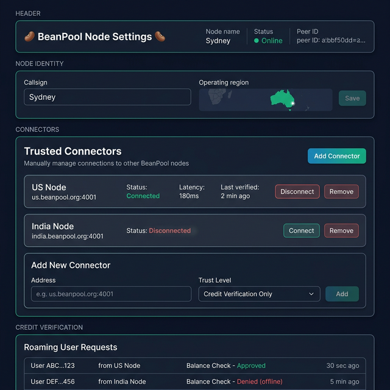
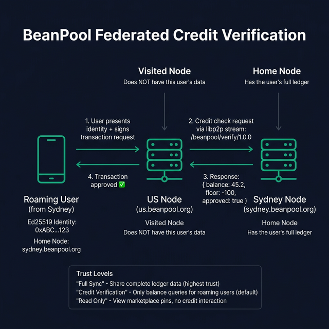

# 🌐 BeanPool Global Mesh Network

> A guide to every server, port, and DNS record in the BeanPool network.

---

## 🍌 The Banana-Simple Version

BeanPool is a **federation of sovereign nodes** — each node is independently operated and controlled by its host admin. There is no central server and no automatic mesh. Each node decides which other nodes to trust and connect to. When your phone opens the BeanPool app, it connects to your local node. If you travel, the visited node verifies your credits directly with your home node — no data replication needed.

---

## 🗺️ The Nodes

Every node runs the same software in a Docker container. Each one has:
- A **public IP** — the raw network address
- A **DNS name** — a human-friendly alias (like `sydney.beanpool.org`)
- A **callsign** — the name shown on the dashboard (like "Sydney")

| # | Flag | Callsign | IP Address | DNS Name | Dashboard |
|---|------|----------|-----------|----------|-----------|
| 1 | 🇦🇺 | Sydney | `20.211.27.68` | `sydney.beanpool.org` | [Dashboard](http://sydney.beanpool.org:8080) |
| 2 | 🇮🇳 | India | `40.80.89.236` | `india.beanpool.org` | [Dashboard](http://india.beanpool.org:8080) |
| 3 | 🇨🇦 | Canada | `20.104.200.150` | `canada.beanpool.org` | [Dashboard](http://canada.beanpool.org:8080) |
| 4 | 🇫🇷 | France | `40.89.161.113` | `france.beanpool.org` | [Dashboard](http://france.beanpool.org:8080) |
| 5 | 🇿🇦 | South Africa | `102.133.228.40` | `safrica.beanpool.org` | [Dashboard](http://safrica.beanpool.org:8080) |
| 6 | 🇸🇪 | Sweden | `4.223.65.87` | `sweden.beanpool.org` | [Dashboard](http://sweden.beanpool.org:8080) |
| 7 | 🇰🇷 | Korea | `20.194.24.118` | `korea.beanpool.org` | [Dashboard](http://korea.beanpool.org:8080) |
| 8 | 🇵🇱 | Poland | `20.215.185.207` | `poland.beanpool.org` | [Dashboard](http://poland.beanpool.org:8080) |
| 9 | 🇨🇱 | Chile | `57.156.64.229` | `chile.beanpool.org` | [Dashboard](http://chile.beanpool.org:8080) |
| 10 | 🇺🇸 | US | `20.96.126.56` | `us.beanpool.org` | [Dashboard](http://us.beanpool.org:8080) |
| 🏠 | 🏠 | Lighthouse | `139.216.78.171` | `lighthouse.beanpool.org` | *(home network — DMZ working!)* |

> **⚠️ Hairpin NAT:** The Archer AX10 router does NOT support Hairpin NAT. You cannot reach `lighthouse.beanpool.org` or any `:8080`/`:3001` port from inside the LAN via the DDNS hostname — use `192.168.1.219` directly. External users can connect fine.

### Where do they live?

- **Nodes 1–9** are Azure cloud VMs (account: `sunshinescorpio`, free trial — expires ~April 2026)
- **Node 10** is an Azure VM on the `cytec` account (pay-as-you-go, free tier `B2s_v2`)
- **Lighthouse** is a physical Debian laptop at home, running 24/7

---

## 🔌 The Ports

Every BeanPool node listens on **4 ports**. These are standardized across all environments.

| Port | Protocol | What It Does | Who Uses It |
|------|----------|-------------|-------------|
| **4001** | TCP | **P2P Communication** — nodes gossip, sync data, and discover each other. Uses [libp2p](https://libp2p.io/). | Other nodes |
| **4002** | TCP | **WebSocket P2P** — same as 4001 but via WebSocket. Needed for browser-based clients. | Browsers, mobile apps |
| **8080** | HTTP | **Trust Bootstrap & Onboarding** — the landing page with QR codes for certificate trust and PWA installation. | You (browser), new users |
| **8443** | HTTPS | **PWA Host** — the sovereign community interface (marketplace, ledger, identity). | You (browser), mobile |

### Can I change them?

Yes! Every port is configurable via environment variables:

| Env Var | Default | Controls |
|---------|---------|----------|
| `PORT_P2P` | `4001` | P2P TCP port (WebSocket is always +1) |
| `PORT_METRICS` | `8080` | Dashboard & API port |
| `PORT_HTTPS` | `8443` | Settings page port |

---

## 🧅 DNS — The "Friendly Names"

Instead of remembering `20.211.27.68`, you can use `sydney.beanpool.org`. These DNS records are hosted on **Cloudflare** (free tier) under the domain `beanpool.org`.

### How DNS records are managed

**They're automatic.** Every time a node starts, it calls the Cloudflare API and registers (or updates) its own A record. If a node's IP changes, the DNS record updates itself on next boot.

This is controlled by 3 environment variables:

| Env Var | What It Is |
|---------|-----------|
| `CF_API_TOKEN` | Cloudflare API token with DNS edit permission |
| `CF_ZONE_ID` | The zone ID for `beanpool.org` |
| `CF_RECORD_NAME` | The subdomain this node claims (e.g. `sydney.beanpool.org`) |

---

## 🔗 Sovereign Connectors — How Nodes Connect

BeanPool nodes are **sovereign by default** — each node is isolated and independent. The node admin has full control over which other nodes to connect to, if any. There is no automatic discovery, no hardcoded bootstrap list, and no central coordination.

### Philosophy

Unlike traditional mesh networks, BeanPool does NOT:
- Automatically discover and connect to all available nodes
- Broadcast heartbeats to a central registry
- Replicate the full database across the network

Instead, each node admin **manually establishes trust relationships** with specific peers through the **Trusted Connectors** settings page.

### Connector Configuration UI



The settings page at `/settings` allows the admin to:
- **Add connectors** — specify the address (e.g. `us.beanpool.org:4001`) and trust level
- **Connect/Disconnect** — toggle individual connections on demand
- **Monitor status** — see latency, connection state, and last verification time
- **Remove connectors** — permanently remove a trusted peer

### Trust Levels

Each connector has a configurable trust level that determines what data is shared:

| Trust Level | Name | Description | Data Shared | Use Case |
|-------------|------|-------------|-------------|----------|
| **`read_only`** | Observer | View public ledger activity, no transactions | Public ledger entries only | Monitor a community's activity without participating |
| **`credit_verification`** | Trading Partner | Cross-community credit verification for roaming users (default) | Balance checks via `/beanpool/verify/1.0.0` | Two communities enabling member-to-member trade |
| **`full_sync`** | Full Mirror | Complete data replication for redundancy | All ledger + member + marketplace data | **Backup nodes** and geographic resilience |

#### Making a Backup Node

`full_sync` IS the backup mechanism. To create a backup:

1. Spin up a second BeanPool node (e.g. `backup.beanpool.org`)
2. On your **primary**, add the backup as a connector with `full_sync` trust
3. On the **backup**, add the primary as a connector with `full_sync` trust
4. The handshake confirms mutual `full_sync` trust
5. The nodes continuously replicate all community data
6. If the primary goes down, the backup has a complete copy

### Federated Credit Verification

When a user from one node travels to another, the visited node does NOT need the user's full database. Instead, it queries the user's home node in real-time:



**The 4-step flow:**
1. **User presents identity** — the roaming user's Ed25519 public key identifies which node they belong to
2. **Visited node queries home node** — via libp2p stream `/beanpool/verify/1.0.0`
3. **Home node responds** — returns balance, credit floor, and approval status
4. **Visited node processes transaction** — approves or denies based on the response

This ensures that each node only shares the minimum data needed for cross-node commerce.

---

## 🚀 Deployment

### Deploy to all Azure nodes
```bash
bash deploy.sh              # all 10 nodes
bash deploy.sh 1 3 7        # specific nodes by number
```

### Deploy to a single node manually
```bash
ssh -i ~/.ssh/id_azure_beanpool azureuser@<IP>
cd /home/azureuser/BeanPool
sudo docker compose -p beanpool up -d --build
```

---

## 📁 Key Files

| File | Purpose |
|------|---------|
| `docker-compose.yml` | Port mappings, env vars, volume mounts |
| `apps/server/src/index.ts` | Main BeanPool Node — 5-stage boot orchestrator |
| `apps/server/src/genesis.ts` | Community keypair + Genesis Block generation |
| `apps/pwa/src/App.tsx` | PWA shell — identity gate, bottom nav, header |
| `deploy.sh` | Deploys to Azure nodes, passes CF credentials |
| `.env` | Cloudflare secrets (gitignored) |
| `data/genesis.json` | Community identity + genesis hash (auto-generated) |
